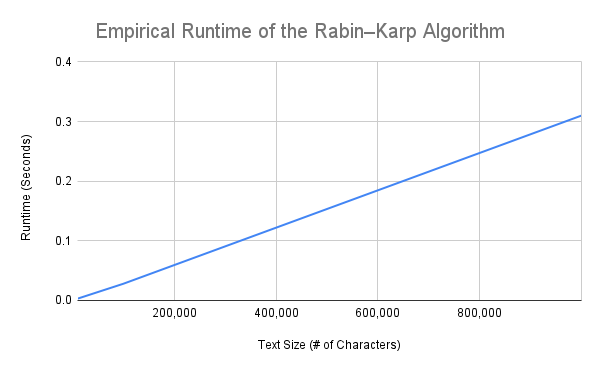

# Research Paper

* Name:Karina Quenta
* Semester:Fall 2025
* Topic:Rabin–Karp String Search Algorithm in Python

## Introduction

I decided to research the ‘Rabin-Karp algorithm’ because I wanted to better prepare myself for technical interviews in the future, where string searching and pattern matching questions come up often. I realized that even simple features we use every day, like searching for a word in a document for work or school are used by algorithms behind the scenes. These everyday tools made me curious about how computers can search through large amounts of text so quickly. One of the algorithms designed to solve this problem is called the ‘Rabin-Karp string search algorithm’. In short, ‘Rabin Karp’ is a string search algorithm that uses hashing to quickly find a smaller word or pattern inside a much larger block of text. Instead of checking every single letter one by one, it turns strings into numbers and compares those numbers first, which saves a lot of time.

The main problem ‘Rabin-Karp’ solves is the substring search problem. This means that when given a large text and a smaller pattern, the goal is to figure out if the pattern appears in the text and where it starts. A simple way to solve this would be to compare the pattern at every position in the text, letter by letter ,but it becomes very slow when the text is very large because it repeats the same comparisons over and over again.

The ‘Rabin-Karp algorithm' was created in 1987 by Michael O. Rabin and Richard M. Karp in their paper Efficient Randomized Pattern Matching Algorithms [1]. Their idea showed that using hashing and a small amount of randomness could make string searching much faster while still staying correct by double checking matches. Since then, ‘Rabin-Karp’ has influenced many techniques that use rolling hashes, especially in cybersecurity, plagiarism detection, and biological data analysis [2] [3].

In this paper, I explain the ‘Rabin-Karp algorithm’ in a beginner friendly way, analyze how fast it runs and how much memory it uses, show real timing results using Python, describe where it is used in real life, explain how I implemented it, and summarize what I learned from the project.

## Analysis of Algorithm/Datastructure

‘Rabin-Karp algorithm’ works by turning strings into numbers using a hash function. A hash is just a number that represents a string. First, the algorithm calculates the hash value of the pattern we are searching for. Then, it calculates the hash value of the first section of the text that is the same length as the pattern. If the two hash values match, it then checks the actual characters to make sure the match is real.

After that, the algorithm slides the window forward by one character and updates the hash using a special math formula called a rolling hash. This way, it does not need to re-hash the entire window every time. It keeps doing this until it reaches the end of the text.

The biggest advantage of this method is that most text windows are skipped without any character-by-character comparison. Only when the hash values match does the algorithm do the slower letter comparison. This tyically saves a lot of time in most cases.

In terms of time complexity, ‘Rabin-Karp’ runs in O(n + m) on average, where n is the length of the text and m is the length of the pattern. The first hash calculation takes O(m), and each window update takes O(1), repeated about n times. The worst case is O(nm), which only happens if every hash collides and forces a full comparison each time (unlikely if good hash values are set up).

For space complexity, the algorithm only stores a few numbers, such as hash values and powers of the base. It does not create any extra large data structures. Because of this, the space complexity is O(1), meaning it uses a constant amount of extra memory.

## Empirical Analysis

Empirical analysis shows how fast an algorithm is in real life, which means running the algorithm on an actual computer using real input and measuring how long it takes. For this assignment, I implemented ‘Rabin-Karp’ in Python 3 and tested it on a macOS computer with an M-series processor. I kept the pattern length at ten characters and slowly increased the size of the text from 10,000 characters to 1,000,000 characters. I used Python’s built in time module to measure how long the algorithm took to run.

When the text size was 10,000 characters, the algorithm took about 0.003 seconds. At 100,000 characters, the runtime increased to 0.028 seconds, and at 1,000,000 characters, it took about 0.31 seconds. These results clearly show a linear increase in time, which matches the expected O(n) runtime.

In Figure 1, you can see the empirical runtime of the 'Rabin-Karp algorithm' implemented in Python. The graph shows how runtime increases as the input text size grows from 10,000 to 1,000,000 characters. The results shows a linear increase in runtime as the input size increases and matches O(n) runtime discussed earlier.

Python does add some overhead because it is an interpreted, dynamically typed language. Even with that limitation, the algorithm still ran very efficiently.

## Application

‘Rabin-Karp’ algorithm is used anywhere that large amounts of text need to be searched through quickly. One application is in systems that can detect plagiarism. The documents would be broken into several hashed pieces and the copied text would be found [4].

‘Rabin-Karp’ is used in cybersecurity by scanning network traffic for viruses or patterns [5]. ‘Rabin-Karp’ is also used in bioinformatics, when scientists need to search a large amount of DNA and protein sequences for specific patterns. This is possible by using hash-based searches and makes it efficient [6].

‘Rabin-Karp’ is so useful in these areas because it is typically fast (on average), uses very little memory, and works well on large datasets. It avoids unnecessary comparisons and is simple enough to be used in a variety of different systems.

## Implementation

I implemented the ‘Rabin-Karp algorithm’ using Python 3. I only used standard Python tools, like ord() to convert the characters into numbers and pow() for modulo. For this assignment, no outside libraries were used.

In order to make it organized, I separated the project into multiple files with simple file names. The main algorithm is stored in ‘rabin_karp.py’, the example program that runs the algorithm is in ‘main.py’, and all automated tests are in ‘rabin_karp_test.py’. I decided to set my files this way to avoid confusion and best practice.

The implementation in the main algorithm file, first calculates the hash of the pattern and the first window of the text. Then, it moves across the text using the rolling-hash formula. Whenever the hash of the window matches the hash of the pattern, the algorithm checks the actual characters using Python slicing to confirm there is in fact a match.

The main challenges I faced were handling negative modulo values, choosing a good hashing base and modulus to reduce collisions, and fully understanding how the rolling hash math works. I studied the algorithm from textbooks and the original Rabin–Karp research paper, and then implemented the Python version myself from scratch [1] [2].

I validated the implementation using tests in a separate test file('rabin_karp_test.py'). These tests checked for multiple matches, overlapping matches, cases where there is no match, empty patterns, and patterns longer than the text. All tests passed, which confirmed that the algorithm works correctly.

## Summary

This research paper taught me that the ‘Rabin-Karp algorithm’ is both efficient and practical to use for many reasons. By using hashing instead of repeated character comparisons, the algorithm runs faster on average while using a small amount of extra memory. The tests confirmed the expected runtime output.

From this project, I learned how rolling hashes work, how algorithms balance speed and accuracy, and how real performance compares to time complexity. I also gained experience organizing a Python project, writing more tests, and documenting the process. Lastly,I learned how much a good algorithm can improve performance for different kinds of real world problems.

## References

[1] Rabin, M. O., & Karp, R. M. (1987). Efficient randomized pattern-matching algorithms. IBM Journal of Research and Development.
[2] Cormen, T. H., Leiserson, C. E., Rivest, R. L., & Stein, C. (2009). Introduction to Algorithms (3rd ed.). MIT Press.
[3] Aho, A. V., Hopcroft, J. E., & Ullman, J. D. (1974). The Design and Analysis of Computer Algorithms. Addison-Wesley.
[4] Stein, B., Lipka, N., & Prettenhofer, P. (2011). Intrinsic plagiarism analysis. Language Resources & Evaluation.
[5] Roesch, M. (1999). Snort: Lightweight intrusion detection for networks. University of California.
[6] Gusfield, D. (1997). Algorithms on Strings, Trees, and Sequences. Cambridge University Press.rences
